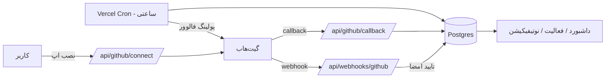

<div align="center">

🇮🇷 فارسی | [🇬🇧 English](./README.md)

</div>

<div align="center">

# 📡 گیت‌هاب مانیتور (GitHub Monitor)

**تپش قلب همه‌ی ریپوزیتوری‌های گیت‌هابت رو تو یک داشبورد تمیز ببین.**

کامیت‌ها · استارها · فورک‌ها · پول‌ریکوئست‌ها · ایشوها · ریلیزها · دیپلوی‌ها · فالوورها

[](https://nextjs.org)
[](https://www.typescriptlang.org)
[](https://www.better-auth.com)
[](https://orm.drizzle.team)
[](https://tailwindcss.com)
[](https://vercel.com)
[](#-لایسنس)

[معرفی](#-معرفی) •
[امکانات](#-امکانات) •
[معماری](#️-معماری) •
[راهنمای نصب](#-راهنمای-کامل-نصب-صفر-تا-صد) •
[امنیت](#-امنیت) •
[سوالات متداول](#-سوالات-متداول)

</div>

---

## 🧭 معرفی

**GitHub Monitor** یک اپ وب به سبک SaaS هست که ریپوزیتوری‌ها و اکانت گیت‌هابت رو زیر نظر می‌گیره و رویدادهای خام گیت‌هاب رو به یک فید فعالیت تمیز و قابل‌فیلتر، به‌همراه یک مرکز نوتیفیکیشن تبدیل می‌کنه — دیگه لازم نیست ده‌ها تب گیت‌هاب رو رفرش کنی تا بفهمی چه اتفاقی افتاده.

اتصال به گیت‌هاب به روش «درست» انجام می‌شه — از طریق یک **GitHub App**، نه یک توکن OAuth ساده — یعنی مجوزهای دقیق و جداگانه برای هر ریپو، وبهوک‌های خودکارمدیریت‌شده، و rate limit بالاتر نسبت به یک personal access token معمولی.

> ساخته‌شده برای مینتینرهای مستقل و تیم‌های کوچیکی که می‌خوان همه‌چیز رو یک‌جا و منظم ببینن.

---

## ✨ امکانات

<table>
<tr>
<td width="50%" valign="top">

### 📊 داشبورد
- آمار زنده: تعداد ریپو، ریپوهای مانیتورشده، رویدادهای امروز، نوتیفیکیشن‌های نخونده
- فید فعالیت اخیر با آیکون و رنگ مخصوص هر نوع رویداد

### 📁 مدیریت ریپوزیتوری‌ها
- لیست زنده و همگام با گیت‌هاب (جستجو، فیلتر، مرتب‌سازی بر اساس استار/فورک)
- روشن/خاموش‌کردن مانیتورینگ هر ریپو با یک کلیک
- **۱۰ سوییچ جداگانه** برای دسته‌های مختلف رویداد، به تفکیک هر ریپو

### 🔔 مرکز نوتیفیکیشن
- تب‌های همه/نخونده‌ها
- خوانده‌کردن تکی یا همه با یک کلیک
- صفحه‌بندی‌شده — هیچ‌وقت هزاران ردیف یکجا لود نمی‌شه

</td>
<td width="50%" valign="top">

### 🕓 تاریخچه‌ی فعالیت
- فیلتر بر اساس ریپو، نوع رویداد، بازه‌ی تاریخ، و جستجوی آزاد
- گروه‌بندی‌شده بر اساس **امروز / دیروز / تاریخ**
- لینک مستقیم به همون رویداد در گیت‌هاب

### 📈 آمار و ارقام
- بازه‌های امروز / ۷ روز / ۳۰ روز / سفارشی
- کامیت، استار، فورک، PR، ایشو، ریلیز — همه در یک نگاه

### 👤 ردیابی فالوورها
- تشخیص فالوور جدید **و** آنفالو
- گیت‌هاب برای این مورد هیچ webhook ای نداره — با polling ساعتی انجام می‌شه، و رابط کاربری صادقانه اینو «real-time» جا نمی‌زنه

### ⚙️ تنظیمات
- حساب کاربری (تغییر پسورد، حذف اکانت)
- اتصال گیت‌هاب (وصل/قطع، با یک کلیک)
- نوتیفیکیشن‌ها (کلید خاموش/روشن کلی + میان‌برهای per-repo)

</td>
</tr>
</table>

---

## 🏗️ معماری

<table>
<tr><th>لایه</th><th>انتخاب</th><th>چرا</th></tr>
<tr><td>فریم‌ورک</td><td>Next.js 15 (App Router) + TypeScript</td><td>همه‌جا Server Component و Server Action؛ نیازی به یک لایه‌ی API جدا نیست</td></tr>
<tr><td>رابط کاربری</td><td>Tailwind CSS v4 + shadcn/ui</td><td>کامپوننت‌های در‌دسترس و کد کاملاً مال خودت (نه یک کتابخانه‌ی جعبه‌سیاه)</td></tr>
<tr><td>احراز هویت</td><td>Better Auth</td><td>پشتیبانی native از ایمیل/پسورد + کنترل کامل روی اسکیمای DB برای ذخیره‌ی توکن</td></tr>
<tr><td>دیتابیس</td><td>Vercel Postgres (Neon) + Drizzle ORM</td><td>سازگار با سرورلس، کوئری‌های type-safe، migrationهای واقعی SQL</td></tr>
<tr><td>اتصال گیت‌هاب</td><td>GitHub App</td><td>مجوزهای دقیق per-repo، وبهوک خودکار، ۱۵٬۰۰۰ درخواست/ساعت در مقابل ۵٬۰۰۰ تای OAuth</td></tr>
<tr><td>پولینگ فالوور</td><td>Vercel Cron (ساعتی)</td><td>گیت‌هاب رویداد «follow» نداره — این تنها راه صادقانه است</td></tr>
<tr><td>دیپلوی</td><td>Vercel</td><td>سرورلس بدون کانفیگ اضافه + پشتیبانی درجه‌یک از Cron Jobs</td></tr>
</table>

### جریان درخواست‌ها



### ساختار پروژه

```
src/
├─ app/
│  ├─ (auth)/              لاگین، ثبت‌نام — عمومی
│  ├─ (app)/                داشبورد، ریپوها، فعالیت،
│  │                         نوتیفیکیشن، آمار، تنظیمات — محافظت‌شده
│  └─ api/
│     ├─ auth/[...all]/     روت‌هندلر Better Auth
│     ├─ github/            connect · callback (فرآیند نصب GitHub App)
│     ├─ webhooks/github/   دریافت‌کننده‌ی وبهوک امضاشده
│     └─ cron/followers/    مقصد Vercel Cron
├─ components/
│  ├─ ui/                   کامپوننت‌های پایه‌ی shadcn/ui (۲۴ کامپوننت)
│  └─ <feature>/             کامپوننت‌های مخصوص هر بخش
└─ lib/
   ├─ auth/                 تنظیمات Better Auth، سشن، اعتبارسنجی
   ├─ db/                   اسکیمای Drizzle (۱۳ جدول) + اتصال
   ├─ github/                کلاینت App، نرمال‌سازی وبهوک، منطق sync
   ├─ security/              تایید امضا، رمزنگاری AES-256-GCM، state ضدCSRF
   ├─ notifications/         کوئری‌ها و تنظیمات
   └─ activity/, dashboard/, statistics/   دیتالایر مخصوص هر صفحه
```

---

## 🚀 راهنمای کامل نصب (صفر تا صد)

### پیش‌نیازها

| نیازمندی | توضیح |
|---|---|
| Node.js نسخه‌ی ۲۰ به بالا | |
| اکانت Vercel — **پلن Pro** | پلن Hobby فقط یک بار در روز کرون اجرا می‌کنه؛ ردیابی فالوور به اجرای ساعتی نیاز داره |
| دیتابیس Vercel Postgres (Neon) | از داشبورد Vercel بسازش |
| یک GitHub App که خودت مدیریتش می‌کنی | مرحله‌ی ۱ زیر |

### مرحله‌ی ۱ — ساخت GitHub App

۱. برو به **GitHub → Settings → Developer settings → GitHub Apps → New GitHub App**
۲. این فیلدها رو پر کن:

   | فیلد | مقدار |
   |---|---|
   | Homepage URL | آدرس دیپلوی‌شده‌ی اپت (یا `http://localhost:3000` موقع تست) |
   | Callback URL | `https://<دامنه‌ی-تو>/api/github/callback` |
   | Webhook URL | `https://<دامنه‌ی-تو>/api/webhooks/github` |
   | Webhook secret | با `openssl rand -hex 32` بساز و نگهش دار |

۳. **Repository permissions** — همه رو روی **Read-only** بذار:
   `Contents` · `Metadata` · `Pull requests` · `Issues` · `Actions` · `Deployments`

۴. **Subscribe to events**:
   `push` `star` `fork` `pull_request` `pull_request_review` `issues`
   `issue_comment` `release` `create` `delete` `workflow_run` `deployment`
   `deployment_status` `installation` `installation_repositories`

۵. **Where can this app be installed؟** → Any account (یا "Only this account" برای استفاده‌ی شخصی)

۶. اپ رو بساز و این‌ها رو جمع کن:
   - **App ID** و **Client ID** (بالای صفحه‌ی تنظیمات)
   - یک **Client secret** تولیدشده
   - یک **Private key** تولیدشده (فایل `.pem` — کل محتواش می‌ره تو `GITHUB_APP_PRIVATE_KEY`)
   - **slug** اپ، از URL صفحه‌ی تنظیماتش: `github.com/settings/apps/<slug>`

### مرحله‌ی ۲ — تنظیم متغیرهای محیطی

```bash
cp .env.example .env.local
```

هر متغیر داخل `.env.example` توضیح داره. خلاصه‌ش:

<details>
<summary><strong>برای دیدن لیست کامل کلیک کن</strong></summary>

| متغیر | منبع |
|---|---|
| `DATABASE_URL` | اتصال Vercel Postgres (Neon) |
| `BETTER_AUTH_SECRET` | `openssl rand -base64 32` |
| `ENCRYPTION_KEY` | `openssl rand -base64 32` |
| `GITHUB_APP_ID` | صفحه‌ی تنظیمات GitHub App |
| `GITHUB_APP_SLUG` | آدرس صفحه‌ی تنظیمات GitHub App |
| `GITHUB_APP_CLIENT_ID` | صفحه‌ی تنظیمات GitHub App |
| `GITHUB_APP_CLIENT_SECRET` | صفحه‌ی تنظیمات GitHub App |
| `GITHUB_APP_PRIVATE_KEY` | محتوای فایل `.pem` دانلودشده |
| `GITHUB_WEBHOOK_SECRET` | `openssl rand -hex 32` (همون مرحله‌ی ۱) |
| `CRON_SECRET` | `openssl rand -hex 32` |
| `NEXT_PUBLIC_APP_URL` / `BETTER_AUTH_URL` | آدرس عمومی اپت |

</details>

### مرحله‌ی ۳ — نصب و migration

```bash
npm install
npm run db:migrate
```

### مرحله‌ی ۴ — اجرای محلی

```bash
npm run dev
```

برو به **http://localhost:3000**. وبهوک‌های گیت‌هاب به یک آدرس عمومی نیاز دارن — با `ngrok http 3000` یک تانل بزن و Webhook URL گیت‌هاب اپ رو موقع تست محلی به همون تانل اشاره بده.

### مرحله‌ی ۵ — دیپلوی روی Vercel

۱. ریپو رو داخل Vercel ایمپورت کن.
۲. هر متغیری که در `.env.example` هست رو در **Settings → Environment Variables** اضافه کن.
۳. مطمئن شو `CRON_SECRET` هم اونجا ست شده — Vercel خودکار این رو به‌عنوان Bearer token به `/api/cron/followers` می‌فرسته (زمان‌بندی در `vercel.json` تعریف شده).
۴. پروژه رو به پلن **Pro** آپگرید کن (پلن Hobby بی‌سروصدا کرون رو به یک‌بار در روز تنزل می‌ده).
۵. دیپلوی کن، بعد Callback/Webhook URL های GitHub App رو به دامنه‌ی production آپدیت کن.

---

## 🔒 امنیت

یک ممیزی کامل بر اساس یک چک‌لیست ۱۹ موردی (احراز هویت، مجوزدهی، CSRF، XSS، SQLi، SSRF، IDOR، rate limiting و بیشتر) انجام شده — جزئیات در تاریخچه‌ی کامیت‌ها موجوده. نکات برجسته:

- ✅ payload وبهوک‌ها قبل از هر پردازشی با `X-Hub-Signature-256` و مقایسه‌ی **timing-safe** تایید می‌شن
- ✅ تحویل وبهوک‌ها با `X-GitHub-Delivery` دوبار-ارسال‌نشدنی هستن (unique constraint دیتابیس) — retryها هیچ‌وقت رویداد تکراری نمی‌سازن
- ✅ توکن‌های نصب گیت‌هاب **در حالت ذخیره‌سازی رمزنگاری‌شده‌ن** (AES-256-GCM)
- ✅ فرآیند نصب GitHub App در برابر CSRF با یک state token امضاشده، منقضی‌شونده، و bound به سشن محافظت می‌شه
- ✅ Rate limiting در **دیتابیس** ذخیره می‌شه (نه در حافظه — که بین instanceهای سرورلس Vercel بی‌اثر می‌شد)
- ✅ هر Server Action سشن رو دوباره سمت سرور می‌گیره و هر کوئری رو به کاربر لاگین‌شده scope می‌کنه — هیچ ID ای که از کلاینت میاد بدون چک مالکیت پذیرفته نمی‌شه

---

## 🛠️ اسکریپت‌های مفید

| دستور | توضیح |
|---|---|
| `npm run dev` | اجرای سرور توسعه |
| `npm run build` | ساخت نسخه‌ی production |
| `npm run lint` | اجرای ESLint |
| `npm run db:generate` | ساخت migration جدید از تغییرات schema |
| `npm run db:migrate` | اعمال migrationها روی دیتابیس |
| `npm run db:push` | push مستقیم schema (سریع، بدون فایل migration) |
| `npm run db:studio` | باز کردن Drizzle Studio (مرورگر بصری دیتابیس) |

---

## ❓ سوالات متداول

<details>
<summary><strong>چرا GitHub App به‌جای یک OAuth App ساده؟</strong></summary>
<br>
گیت‌هاب صراحتاً GitHub App رو برای این نوع ابزارها توصیه می‌کنه: مجوزهای جداگانه برای هر ریپو به‌جای اسکوپ‌های گسترده‌ی OAuth، وبهوک‌های خودکار ثبت و مدیریت‌شده، توکن‌های کوتاه‌عمر، و rate limit به میزان ۱۵٬۰۰۰ درخواست در ساعت به ازای هر installation در مقابل ۵٬۰۰۰ تای یک توکن شخصی OAuth.
</details>

<details>
<summary><strong>چرا فالوورها real-time آپدیت نمی‌شن؟</strong></summary>
<br>
سیستم وبهوک گیت‌هاب هیچ رویدادی برای «فلان‌کس تو رو فالو/آنفالو کرد» نداره. تنها راه تشخیصش polling دوره‌ای روی API فالوورهاست، که دقیقاً همون کاریه که Vercel Cron هر ساعت انجام می‌ده. رابط کاربری هم هیچ‌وقت ادعا نمی‌کنه این real-time هست.
</details>

<details>
<summary><strong>روی پلن رایگان (Hobby) ورسل هم کار می‌کنه؟</strong></summary>
<br>
تقریباً بله — همه‌چیز کار می‌کنه، فقط تشخیص تغییر فالوورها به‌جای هر ساعت، فقط یک‌بار در روز اجرا می‌شه، چون Cron Jobs پلن Hobby محدود به زمان‌بندی روزانه‌س.
</details>

---

## 📄 لایسنس

MIT — هرکاری دوست داری باهاش بکن.

<div align="center">

با ☕ و چند صد تا کامیت کوچیک ساخته شده 😄

</div>
