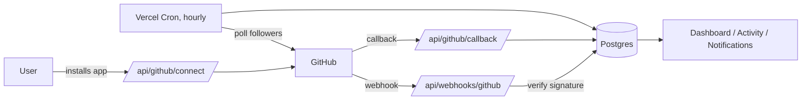

<div align="center">

[🇮🇷 فارسی](./README.fa.md) | 🇬🇧 English

</div>

<div align="center">

# 📡 GitHub Monitor

**Track every heartbeat of your GitHub repositories — in one clean dashboard.**

Commits · Stars · Forks · Pull Requests · Issues · Releases · Deployments · Followers

[](https://nextjs.org)
[](https://www.typescriptlang.org)
[](https://www.better-auth.com)
[](https://orm.drizzle.team)
[](https://tailwindcss.com)
[](https://vercel.com)
[](#-license)

[Overview](#-overview) •
[Features](#-features) •
[Architecture](#-architecture) •
[Setup Guide](#-full-setup-guide) •
[Security](#-security) •
[FAQ](#-faq)

</div>

---

## 🧭 Overview

**GitHub Monitor** is a self-hosted SaaS-style web app that watches your GitHub
repositories and account, and turns raw GitHub events into a clean,
filterable activity feed and notification center — so you never have to
refresh a dozen repo pages to know what happened.

It connects to GitHub the "correct" way — as a **GitHub App**, not a bare
OAuth token — which means fine-grained, per-repository permissions,
automatically managed webhooks, and higher API rate limits than a personal
access token would give you.

> Built for individual maintainers and small teams who want one place to see
> everything happening across the repos they care about.

---

## ✨ Features

<table>
<tr>
<td width="50%" valign="top">

### 📊 Dashboard
- Live counts: repositories, monitored repos, events today, unread notifications
- Recent activity feed with per-event icons and colors

### 📁 Repository management
- Live list synced from GitHub (search, filter, sort by stars/forks)
- One-click monitoring toggle per repository
- **10 independent event-category toggles** per repository

### 🔔 Notification center
- All / Unread tabs
- Mark one or all as read
- Paginated — never loads thousands of rows at once

</td>
<td width="50%" valign="top">

### 🕓 Activity history
- Filter by repository, event type, date range, and free-text search
- Grouped by **Today / Yesterday / date**
- Deep links straight to the event on GitHub

### 📈 Statistics
- Today / 7 Days / 30 Days / custom range picker
- Commits, stars, forks, PRs, issues, releases at a glance

### 👤 Follower tracking
- Detects new **and** lost followers
- GitHub has no webhook for this — handled via hourly polling, and the UI
  is honest about that (no fake "real-time" claims)

### ⚙️ Settings
- Account (change password, delete account)
- GitHub connection (connect / disconnect, one click)
- Notifications (global kill-switch + per-repo shortcuts)

</td>
</tr>
</table>

---

## 🏗️ Architecture

<table>
<tr><th>Layer</th><th>Choice</th><th>Why</th></tr>
<tr><td>Framework</td><td>Next.js 15 (App Router) + TypeScript</td><td>Server Components + Server Actions everywhere; no separate API layer needed</td></tr>
<tr><td>UI</td><td>Tailwind CSS v4 + shadcn/ui</td><td>Accessible primitives, fully owned code (no black-box npm component lib)</td></tr>
<tr><td>Auth</td><td>Better Auth</td><td>Native email/password + full control over the DB schema for token storage</td></tr>
<tr><td>Database</td><td>Vercel Postgres (Neon) + Drizzle ORM</td><td>Serverless-native, type-safe queries, real SQL migrations</td></tr>
<tr><td>GitHub integration</td><td>GitHub App</td><td>Fine-grained per-repo permissions, auto-managed webhooks, 15k req/hr vs 5k for OAuth</td></tr>
<tr><td>Follower polling</td><td>Vercel Cron (hourly)</td><td>GitHub has no "follow" webhook event — this is the only honest option</td></tr>
<tr><td>Deployment</td><td>Vercel</td><td>Zero-config serverless + first-class Cron Jobs support</td></tr>
</table>

### Request flow



### Project structure

```
src/
├─ app/
│  ├─ (auth)/              Login, register — public
│  ├─ (app)/                Dashboard, repositories, activity,
│  │                         notifications, statistics, settings — protected
│  └─ api/
│     ├─ auth/[...all]/     Better Auth route handler
│     ├─ github/            connect · callback  (GitHub App install flow)
│     ├─ webhooks/github/   Signed webhook receiver
│     └─ cron/followers/    Vercel Cron target
├─ components/
│  ├─ ui/                   shadcn/ui primitives (24 components)
│  └─ <feature>/            Feature-scoped components
└─ lib/
   ├─ auth/                 Better Auth config, session, validation
   ├─ db/                   Drizzle schema (13 tables) + connection
   ├─ github/                App client, webhook normalizer, sync logic
   ├─ security/              Signature verify, AES-256-GCM crypto, CSRF state
   ├─ notifications/         Queries + settings
   └─ activity/, dashboard/, statistics/   Page-specific data access
```

---

## 🚀 Full Setup Guide

### Prerequisites

| Requirement | Notes |
|---|---|
| Node.js 20+ | |
| Vercel account — **Pro plan** | Hobby only allows once-daily Cron Jobs; follower tracking needs hourly |
| Vercel Postgres (Neon) database | Provision from the Vercel dashboard |
| A GitHub App you control | Created in step 1 below |

### Step 1 — Create the GitHub App

1. **GitHub → Settings → Developer settings → GitHub Apps → New GitHub App**
2. Fill in:
   | Field | Value |
   |---|---|
   | Homepage URL | your deployed URL (or `http://localhost:3000` while testing) |
   | Callback URL | `https://<your-domain>/api/github/callback` |
   | Webhook URL | `https://<your-domain>/api/webhooks/github` |
   | Webhook secret | generate with `openssl rand -hex 32` — save it |
3. **Repository permissions** — set all to **Read-only**:
   `Contents` · `Metadata` · `Pull requests` · `Issues` · `Actions` · `Deployments`
4. **Subscribe to events**:
   `push` `star` `fork` `pull_request` `pull_request_review` `issues`
   `issue_comment` `release` `create` `delete` `workflow_run` `deployment`
   `deployment_status` `installation` `installation_repositories`
5. **Where can this app be installed?** → Any account (or "Only this account" for personal use)
6. Create the app, then collect:
   - **App ID** and **Client ID** (top of the settings page)
   - A generated **Client secret**
   - A generated **Private key** (`.pem` file — its full contents go into `GITHUB_APP_PRIVATE_KEY`)
   - The app's **slug**, from its settings URL: `github.com/settings/apps/<slug>`

### Step 2 — Configure environment variables

```bash
cp .env.example .env.local
```

Every variable is documented inline in `.env.example`. Summary:

<details>
<summary><strong>Click to expand the full variable list</strong></summary>

| Variable | Source |
|---|---|
| `DATABASE_URL` | Vercel Postgres (Neon) integration |
| `BETTER_AUTH_SECRET` | `openssl rand -base64 32` |
| `ENCRYPTION_KEY` | `openssl rand -base64 32` |
| `GITHUB_APP_ID` | GitHub App settings page |
| `GITHUB_APP_SLUG` | GitHub App settings URL |
| `GITHUB_APP_CLIENT_ID` | GitHub App settings page |
| `GITHUB_APP_CLIENT_SECRET` | GitHub App settings page |
| `GITHUB_APP_PRIVATE_KEY` | Downloaded `.pem` file contents |
| `GITHUB_WEBHOOK_SECRET` | `openssl rand -hex 32` (same one from Step 1) |
| `CRON_SECRET` | `openssl rand -hex 32` |
| `NEXT_PUBLIC_APP_URL` / `BETTER_AUTH_URL` | Your app's public URL |

</details>

### Step 3 — Install and migrate

```bash
npm install
npm run db:migrate
```

### Step 4 — Run locally

```bash
npm run dev
```

Open **http://localhost:3000**. GitHub webhooks need a public URL to reach
you — tunnel with `ngrok http 3000` and point the GitHub App's Webhook URL at
the tunnel while testing locally.

### Step 5 — Deploy to Vercel

1. Import the repo into Vercel.
2. Add every variable from `.env.example` in **Settings → Environment Variables**.
3. Make sure `CRON_SECRET` is set there too — Vercel sends it automatically as
   a Bearer token to `/api/cron/followers` (schedule defined in `vercel.json`).
4. Upgrade the project to **Pro** (Hobby silently downgrades the cron to
   once-daily).
5. Deploy, then update the GitHub App's Callback/Webhook URLs to the
   production domain.

---

## 🔒 Security

A full audit against a 19-point checklist (auth, authorization, CSRF, XSS,
SQLi, SSRF, IDOR, rate limiting, and more) was performed — see the commit
history for details. Highlights:

- ✅ Webhook payloads verified against `X-Hub-Signature-256` with a
  **timing-safe** comparison, before any processing
- ✅ Webhook deliveries deduplicated via `X-GitHub-Delivery` (DB unique
  constraint) — retries never create duplicate events
- ✅ GitHub installation tokens **encrypted at rest** (AES-256-GCM)
- ✅ GitHub App install flow protected against CSRF with a signed,
  expiring, session-bound state token
- ✅ Rate limiting persisted to the **database** (not in-memory — which would
  be ineffective across Vercel's serverless instances)
- ✅ Every Server Action re-derives the session server-side and scopes every
  query to the authenticated user — no client-supplied ID is ever trusted
  without an ownership check

---

## 🛠️ Useful scripts

| Command | Description |
|---|---|
| `npm run dev` | Start the dev server |
| `npm run build` | Production build |
| `npm run lint` | Run ESLint |
| `npm run db:generate` | Generate a new SQL migration from schema changes |
| `npm run db:migrate` | Apply migrations to the database |
| `npm run db:push` | Push schema directly (fast iteration, no migration file) |
| `npm run db:studio` | Open Drizzle Studio (visual DB browser) |

---

## ❓ FAQ

<details>
<summary><strong>Why a GitHub App instead of a simple OAuth App?</strong></summary>
<br>
GitHub explicitly recommends GitHub Apps for this kind of tool: per-repository
permissions instead of broad OAuth scopes, automatically registered and
managed webhooks, short-lived tokens, and a 15,000 req/hour rate limit per
installation versus 5,000 for a personal OAuth token.
</details>

<details>
<summary><strong>Why can't followers update in real time?</strong></summary>
<br>
GitHub's webhook system has no event for "someone followed/unfollowed you."
The only way to detect it is periodic polling of the followers API, which is
exactly what the hourly Vercel Cron job does. The UI never claims this is
real-time.
</details>

<details>
<summary><strong>Does this work on Vercel's free (Hobby) plan?</strong></summary>
<br>
Mostly — everything works except follower-change detection will only run
once a day instead of hourly, since Hobby's Cron Jobs are limited to a daily
schedule.
</details>

---

## 📄 License

MIT — do whatever you'd like with it.

<div align="center">

Made with ☕ and a few hundred small commits.

</div>
